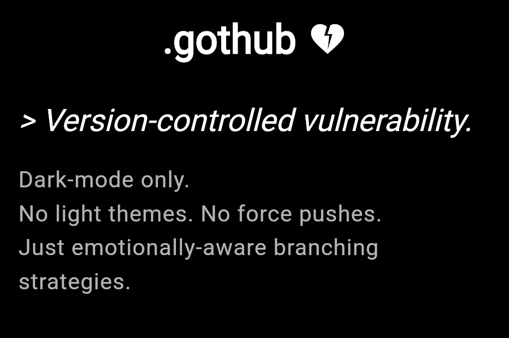

# .gothub

A version control system for unresolved emotions, existential dread, and poorly committed relationships. Because sometimes you need to `git blame` your past to move forward.




> _“I uploaded a feeling. Git refused to track it.”_

## Purpose

.gothub is not your average Git repo. It's a terminal-punk playground for versioning your feelings, stashing your tears, and merging your heartbreak. Built for developers who wear black eyeliner and write Bash scripts at 3 a.m., it’s a parody of Git that processes the human condition with sarcastic puns and melancholic wit.

## Example Commands

```bash
git blame past_love        # Who broke your heart in line 42?
git stash tears            # Save your crying for later
git checkout old_self      # Revert to who you were before *that* relationship
git merge existential_dread # Attempt to reconcile with reality (merge conflicts guaranteed)
git commit -m "still broken" # Immortalize your pain
git push regrets origin/master # Share your suffering with the world
```

## Installation

1. Clone the void:
   ```bash
   git clone https://gothub.com/user/.gothub.git
   ```
2. Install dependencies (requires a broken heart):
   ```bash
   pip install sadness==0.0.1
   npm install --save-dev loneliness
   cargo build --release --from-trauma
   ```
3. Configure your user.soul:
   ```bash
   git config --global user.name "Wistful Coder"
   git config --global user.email "tears@null.dev"
   ```
4. Run the emotional pipeline:
   ```bash
   make cry
   ```

---

# commit_log.txt

```
commit f34dbeef
Author: Wistful Coder <tears@null.dev>
Date:   Fri Aug 01 02:13:37 2025 -0400

    fix(me): patched self-esteem leak, still unstable

commit de1e7ed
Author: Wistful Coder <tears@null.dev>
Date:   Thu Jul 31 23:59:59 2025 -0400

    chore(heart): reindexed shattered hopes, added .gothubignore

commit b4d1dea
Author: Wistful Coder <tears@null.dev>
Date:   Wed Jul 30 04:20:00 2025 -0400

    feat(breakup): implemented git stash tears, sobbed during code review

commit a5h3s0l
Author: Wistful Coder <tears@null.dev>
Date:   Mon Jul 28 01:11:11 2025 -0400

    revert: undid trust.exe, caused fatal runtime errors
```

---

# hooks/post-breakup.sh

```bash
#!/bin/bash

echo "Executing post-breakup hook..."
git stash tears
echo "Tears stashed. You'll cry later."
rm -rf ./memories/*
echo "Deleted shared memories. Disk space reclaimed."
echo "Suggested commit message: 'chore: moved on (barely)'"
notify-send "Breakup complete" "Time to update your .gothubignore."
```

---

# .gothubignore

```
# Don’t track these memories
*.ex
old_photos/
voicemails/
love_letters.txt
hopes_and_dreams.bin
```

---

# LICENSE.txt

.gothub is licensed under the Emotional Damage Clause.

By using this software, you agree to:
- Assume full responsibility for any tears shed during `git merge`.
- Acknowledge that `git revert` cannot undo bad decisions.
- Share your existential dread in the form of poetic commit messages.

No warranties provided. All emotions are distributed AS IS. Use at your own risk.
